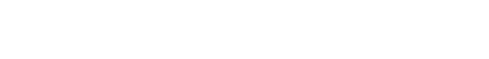

# freeCodeCamp

## Ruta de estudio Frontend Developer 👨🏻‍💻

En este repositorio podrán encontrar todos los ejercicios y proyectos que he realizado en [freeCodeCamp](https://freecodecamp.org) como parte de mi ruta de estudio para convertirme en **Frontend Developer.**

## Curso: Diseño web responsivo 📱💻 🖥️

### 📚 Módulo 1

#### 🧩 Prácticas

- Aplicación de fotos de gatos: [Cat Photo App](https://jhangch.github.io/freeCodeCamp/Practicas/CatPhotoApp)
- Menú de cafetería: [Coffe Menu](https://jhangch.github.io/freeCodeCamp/Practicas/CoffeeMenu)
- Dibujo de marcadores con CSS: [CSS Color Markers](https://jhangch.github.io/freeCodeCamp/Practicas/CSSColorMarkers)
- Formulario de registro: [Registration Form](https://jhangch.github.io/freeCodeCamp/Practicas/RegistrationForm)

#### 🏆 Proyecto

- Proyecto de certificación para el módulo 1 del curso: [Formulario sin Tailwind](https://jhangch.github.io/freeCodeCamp/Proyectos/SurveyForm)

### 📚 Módulo 2

#### 🧩 Prácticas

- Modelo de cajas: [Pintura de Rothko](https://jhangch.github.io/freeCodeCamp/Practicas/RothkoPainting)
- Flexbox: [Photo Gallery](https://jhangch.github.io/freeCodeCamp/Practicas/CSSFlexboxPhotoGallery)
- Tipografía: [Nutrition Label](https://jhangch.github.io/freeCodeCamp/Practicas/NutritionLabel)
- Accesibilidad: [HTML/CSS Quiz](https://jhangch.github.io/freeCodeCamp/Practicas/HTMLCSSQuiz)

#### 🏆 Proyecto

- Proyecto de certificación para el módulo 2 del curso: [Leonardo da Vinci](hhtps://jhangch.github.io/freeCodeCamp/Proyectos/TributePage)

### 📚 Módulo 3

#### 🧩 Prácticas

- Pseudo selectores/elementos: [Balance Sheet](https://jhangch.github.io/freeCodeCamp/Practicas/BalanceSheet)
- Posicionamiento de elementos: [Cat Painting](https://jhangch.github.io/freeCodeCamp/Practicas/CatPainting)
- Diseño web adaptativo: [Piano](https://jhangch.github.io/freeCodeCamp/Practicas/Piano)

#### 🏆 Proyecto

- Proyecto de certificación para el módulo 3 del curso: [Documentación Técnica]()

### 📚 Módulo 4

#### 🧩 Prácticas

- Variables CSS (Custom Properties): [Sky Line]()
- Grid CSS: [Magazine]()

#### 🏆 Proyecto

- Proyecto de certificación para el módulo 4 del curso: [Landing Page]()

### 📚 Módulo 5

#### 🧩 Prácticas

- Animaciones CSS: [Noria]()
- Transformaciones CSS: [Pingüino]()

#### 🏆 Proyecto

- Proyecto de certificación para el módulo 5 del curso: [Portafolio]()

## Recursos que he utilizado para aprender 🗒️

- Roadmap Frontend por [roadmap.sh](https://roadmap.sh/frontend)
- Documentación sobre HTML por [ManzDev](https://manz.dev) - [Lenguaje HTML](https://lenguajehtml.com)
- Documentación sobre CSS por [ManzDev](https://manz.dev) - [Lenguaje CSS](https://lenguajecss.com)
- Documentación sobre JavaScript por [ManzDev](https://manz.dev) - [Lenguaje JS](https://lenguajejs.com)
- Ejercicios [freeCodeCamp](https://www.freecodecamp.org/espanol/learn/2022/responsive-web-design/)
- Flex Froggy por [Thomas Park](https://thomaspark.co/) - [flexboxfroggy.com](https://flexboxfroggy.com/)

> Nota: Estos recursos se irán actualizando a medida que avance en la ruta de estudio.
